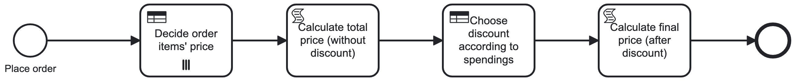
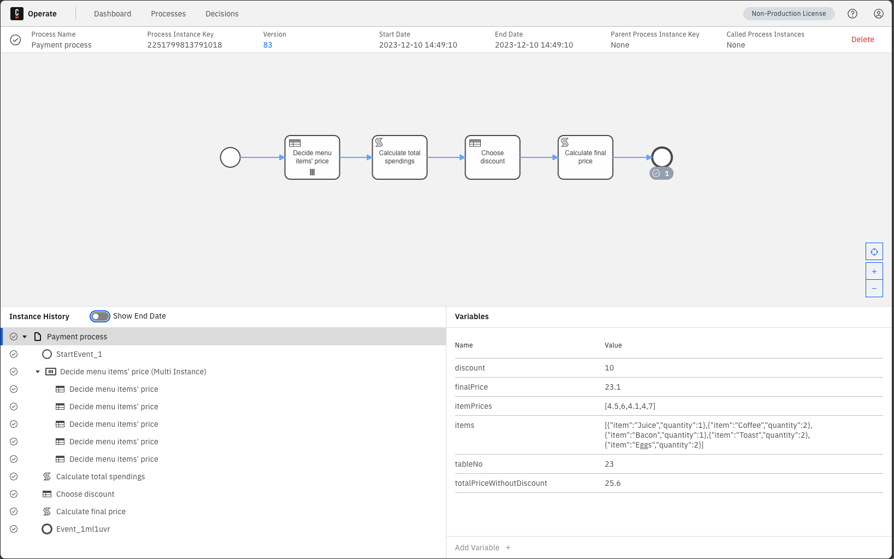

# Camunda DMN parallel processing and FEEL expressions

The demo shows how to use DMN tables for parallel processing and FEEL expressions. No glue, no source code, 
all on Zeebe side. The use case fits restaurant scenario for payment and calculates price with additional discount 
according to total spending. 



<b>Pre-requisites:</b>

1. Install Camunda Modeler (https://camunda.com/download/modeler/)
2. Run Camunda in Docker https://docs.camunda.io/docs/self-managed/platform-deployment/docker/

<b>Steps to reproduce:</b>

1. After uploading bmpn and dmn files from Modeler, trigger processing with some test data:

```json
{
    "tableNo": 23,
    "items": [
        { "item": "Juice", "quantity": 1 },
        { "item": "Coffee", "quantity": 2 },
        { "item": "Bacon", "quantity": 3 },
        { "item": "Toast", "quantity": 2 },
        { "item": "Eggs", "quantity": 2 }
    ]
}
```

2. Navigate to http://localhost:8081/ to see processing results.



